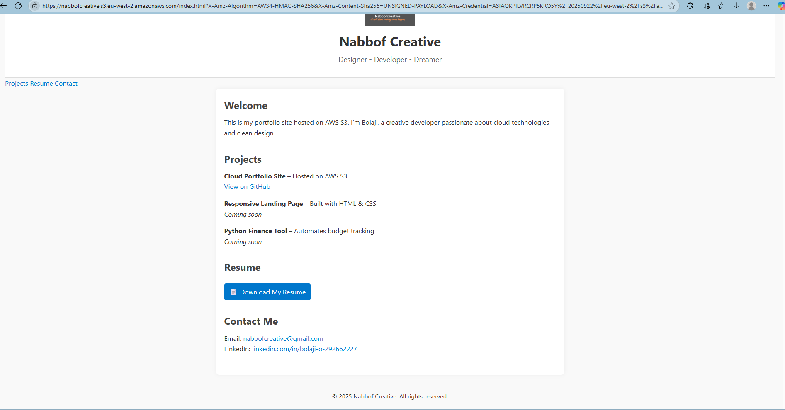

# Nabbof Creative Portfolio

Welcome to my minimalist portfolio site, built with HTML and CSS and hosted on AWS S3. I'm **Bolaji**, a creative developer passionate about cloud technologies, clean design, and building tools that solve real problems.

---

## 🔗 Live Site

🌐 [Visit My Portfolio](https://nabbofcreative.s3-website.eu-west-2.amazonaws.com)  
📁 [View Source on GitHub](https://github.com/bollargy/nabbofcreative.github.io)

---

## 📁 Projects

- **Cloud Portfolio Site**  
  Static website hosted on AWS S3  
  [View Source](https://github.com/bollargy/nabbofcreative.github.io) • [Live Site](https://nabbofcreative.s3-website.eu-west-2.amazonaws.com)

- **Responsive Landing Page**  
  *Coming soon*

- **Python Finance Tool**  
  *Coming soon*

---

## 📄 Resume

[📄 Download My Resume](Bolaji%20OBI%20CV%20(1).pdf)

---

## 📬 Contact

- 📧 Email: [nabbofcreative@gmail.com](mailto:nabbofcreative@gmail.com)  
- 💼 LinkedIn: [linkedin.com/in/bolaji-o-292662227](https://linkedin.com/in/bolaji-o-292662227)

---

## 🖼 Preview

---

## 🛠 Technologies Used

- HTML & CSS
- AWS S3 (Static Website Hosting)
- GitHub for version control

---

© 2025 Nabbof Creative. All rights reserved.
